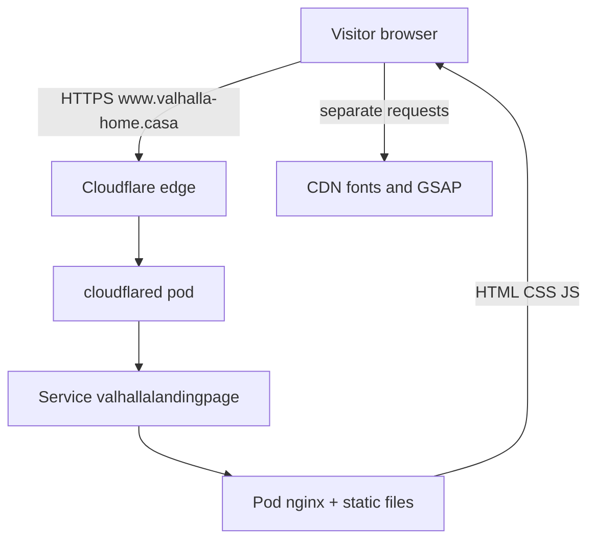
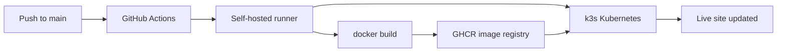

# Valhalla Landing Page

A steampunk-themed hub for Michael Schmidlin's personal web tools — **The Engine Room**. Live at **https://www.valhalla-home.casa**.

Four brass pressure gauges link out to portfolio apps (live and coming soon). The page is static HTML/CSS/JS with scroll-driven gears, procedural SVG, and WebGL steam — see the live site for the full effect.

---

## What this repo contains

| Path | Role |
|------|------|
| [`src/`](src/) | Website source (HTML, CSS, JS) — **no build step** |
| [`Dockerfile`](Dockerfile) | Packages `src/` into an nginx:alpine container |
| [`k8s/`](k8s/) | Kubernetes manifests: Deployment, Service, cloudflared tunnel |
| [`.github/workflows/deploy.yml`](.github/workflows/deploy.yml) | CI/CD — build, push, and roll out on every push to `main` |
| [`docs/`](docs/) | Hosting setup and operations guides |

---

## Tool links

The gauges on the page read from [`src/js/links.js`](src/js/links.js). Edit that file once and the page picks up the change.

| Tool | URL | Status |
|------|-----|--------|
| Portfolio | https://michael.schmidlin.casa | live |
| Trendline Dashboard | (pending) | coming soon |
| Resume Customizer | (pending) | coming soon |
| Budget Analysis | (pending) | coming soon |

---

## Run locally

1. Install the [Live Server](https://marketplace.visualstudio.com/items?itemName=ritwickdey.LiveServer) VS Code extension (recommended via workspace prompt).
2. Open [`src/index.html`](src/index.html) and click **Go Live**.

Open **http://localhost:5500/** — workspace settings in [`.vscode/settings.json`](.vscode/settings.json) pin the server to port **5500** with document root `src/`.

| | Local dev | Production |
|---|-----------|------------|
| **How you run it** | VS Code Live Server | nginx inside a Kubernetes pod |
| **URL** | `http://localhost:5500` | `https://www.valhalla-home.casa` |
| **Updates** | Save file → browser refresh | Merge to `main` → automatic deploy |

---

## How hosting works

### The short version

Valhalla is a **static website** — no server-side code. When you merge a change to `main`, an automated pipeline on a **Linux PC at home** builds a small **container image**, stores it on GitHub, and tells **Kubernetes** to run it. A **Cloudflare Tunnel** (`cloudflared`) exposes that running site to the public internet at **https://www.valhalla-home.casa** — with HTTPS and **without** opening ports on your router.

After a deploy, confirm the latest [Deploy workflow](https://github.com/mschmidlin1/ValhallaLandingPage/actions) run is green, then open the live URL in a browser.

### When someone opens the website

1. **DNS** resolves `www.valhalla-home.casa` (Cloudflare).
2. The **Cloudflare edge** terminates HTTPS and forwards traffic through the tunnel.
3. The **cloudflared** pod in k3s receives the request.
4. **cloudflared** forwards to the cluster **Service** named `valhallalandingpage`.
5. The **Service** routes to the **Pod** running **nginx**.
6. **nginx** returns `index.html`, CSS, and JavaScript from the container filesystem.
7. The **browser** loads additional assets from CDNs (Google Fonts, GSAP on cdnjs) — those requests go straight from the visitor's browser to the CDN, not through your server.



### When you push a change to `main`

Every merge (or direct push) to `main` triggers the **Deploy** workflow in [`.github/workflows/deploy.yml`](.github/workflows/deploy.yml):

1. **GitHub** queues a job and assigns it to the **self-hosted runner** on the home Linux PC.
2. The runner **checks out** the latest code from the repo.
3. **Docker build** packages `src/` into an nginx image tagged with the commit SHA and `:latest`.
4. **Docker push** uploads both tags to **GHCR** (`ghcr.io/mschmidlin1/valhallalandingpage`).
5. **kubectl apply** syncs the Kubernetes manifests in `k8s/`.
6. **kubectl set image** tells the Deployment to use the new SHA-tagged image.
7. Kubernetes performs a **rolling update**: starts a new pod with the new image, waits until it is healthy, then retires the old one.

If anything fails (bad image, pod won't start), the workflow **fails** and the previous version keeps running.



You do not SSH into the server to deploy manually — the pipeline does it.

### Key components

| Term | What it is | Where to see it |
|------|------------|-----------------|
| **GitHub** | Source code and workflow definitions | [github.com/mschmidlin1/ValhallaLandingPage](https://github.com/mschmidlin1/ValhallaLandingPage) |
| **GitHub Actions** | Automation on push to `main` | [Actions tab](https://github.com/mschmidlin1/ValhallaLandingPage/actions) |
| **Self-hosted runner** | Program on the home PC that runs Actions jobs | Repo → Settings → Actions → Runners |
| **Docker / container image** | nginx + static files, packaged for consistent runs | [GHCR package](https://github.com/mschmidlin1/ValhallaLandingPage/pkgs/container/valhallalandingpage) |
| **k3s / Kubernetes** | Keeps containers running; restarts on crash | `kubectl get nodes` on the server |
| **Pod** | One running instance of the nginx container | `kubectl get pods -n valhallalandingpage` |
| **Service** | Stable internal address for the pod | `kubectl get svc -n valhallalandingpage` |
| **cloudflared** | Outbound tunnel from the cluster to Cloudflare | `kubectl get pods -n cloudflared` |
| **Cloudflare** | Public DNS, TLS, and edge routing | [Cloudflare Dashboard](https://dash.cloudflare.com) |

Public access originally used **Tailscale Funnel** (`*.ts.net` URLs). The site now uses **Cloudflare Tunnel** for the custom domain — see [CustomDomainSetup.md](docs/CustomDomainSetup.md) for that migration.

### Day-to-day operations

- **Deploy a change:** merge (or push) to `main`. Watch the green check on the [Actions tab](https://github.com/mschmidlin1/ValhallaLandingPage/actions).
- **Quick health check:** `kubectl get pods -n valhallalandingpage` — expect `Running`, `1/1`.
- **View logs:** `kubectl logs -n valhallalandingpage deploy/valhallalandingpage -f`
- **Roll back a bad deploy:** `kubectl rollout undo deployment/valhallalandingpage -n valhallalandingpage`
- **Redeploy without code changes:** Actions → Deploy → Run workflow.

More commands and troubleshooting: [Self-Hosting.md](docs/Self-Hosting.md) and [KubernetesSetup.md](docs/KubernetesSetup.md).

---

## Documentation

| Doc | Purpose |
|-----|---------|
| [Self-Hosting.md](docs/Self-Hosting.md) | Plain-language pipeline overview — **start here** for newcomers |
| [CustomDomainSetup.md](docs/CustomDomainSetup.md) | Cloudflare Tunnel + custom domain — **current public access model** |
| [KubernetesSetup.md](docs/KubernetesSetup.md) | One-time k3s, runner, and GHCR setup (includes historical Tailscale ingress sections) |
| [DockerSetup.md](docs/DockerSetup.md) | Dockerfile playbook and local `docker run` smoke test |
| [headlamp-setup.md](docs/headlamp-setup.md) | Kubernetes UI on Windows (cluster admin — not required to edit the site) |

---

## Technology

Static HTML/CSS/JS with **no build step**. Libraries from CDNs:

| Library | Version | Purpose |
|---------|---------|---------|
| GSAP + ScrollTrigger | 3.12.5 (cdnjs) | scroll-driven animation |
| Google Fonts | n/a | Cinzel (display), IM Fell English (body), Special Elite (typewriter) |

Gears, smokestacks, gauges, and airship silhouettes are procedurally generated SVG/CSS. Steam uses a trimmed [WebGL Fluid Simulation](https://github.com/PavelDoGreat/WebGL-Fluid-Simulation) (MIT) in `src/lib/fluid/`. **No raster assets** are loaded for the page UI.

---

## Repository layout

```
ValhallaLandingPage/
  src/                    # website source
    index.html
    css/                  # fonts, theme, layout
    js/                   # app logic, links.js, fluid steam
    lib/fluid/            # MIT WebGL fluid sim
  Dockerfile
  .dockerignore
  k8s/                    # namespace, deployment, service, cloudflared
  .github/workflows/      # deploy.yml
  docs/                   # hosting and ops guides
  .vscode/                # Live Server settings
  README.md
```

---

## Editing tips

- **Recolor everything**: edit the CSS variables at the top of [`src/css/theme.css`](src/css/theme.css).
- **Update a link**: edit [`src/js/links.js`](src/js/links.js). Set `status: "live"` and a real `url` to remove the "PENDING" badge.
- **Adjust scroll-rotation speed**: search for `scrub` in [`src/js/app.js`](src/js/app.js) (lower = snappier).
- **Tweak steam frequency**: search `scheduleSteamForStack` in [`src/js/app.js`](src/js/app.js).
- **Tweak steam look**: edit dye/splat settings in [`src/js/fluid-steam.js`](src/js/fluid-steam.js).
- **Tweak steam pressure / rise speed**: adjust `STEAM_PRESSURE` (0–1) at the top of [`fluid-steam.js`](src/js/fluid-steam.js).
