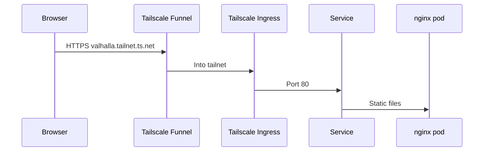
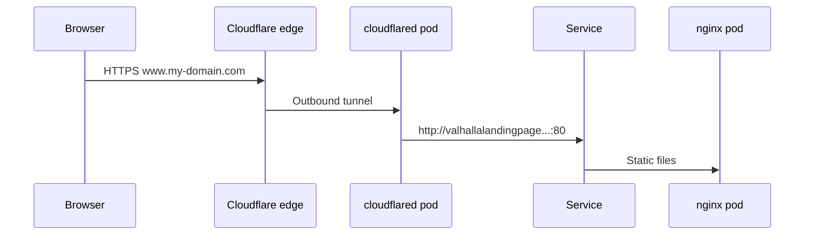
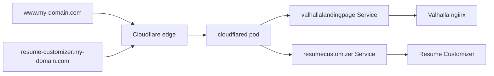

# Custom Domain Setup — Migrating from Tailscale to Cloudflare

This guide explains how to move public access for homelab apps from **Tailscale Funnel** to **Cloudflare Tunnel**, so visitors reach your sites at real domain names on your home k3s cluster.

**Target URLs (example):**

| App | Public URL |
|-----|------------|
| Valhalla Landing Page | `https://www.my-domain.com` |
| Resume Customizer | `https://resume-customizer.my-domain.com` |

For the current deploy stack, see [Self-Hosting.md](Self-Hosting.md). For the original Tailscale-based setup, see [KubernetesSetup.md](KubernetesSetup.md).

---

## Summary

**What we're doing:** Replace Tailscale as the **public front door** with Cloudflare Tunnel. Apps still run in the same k3s cluster on Mint — only how the internet reaches them changes.

**Why:**

1. **Custom domains** — Tailscale Funnel only supports `*.ts.net` hostnames. It cannot issue a valid TLS certificate for `www.my-domain.com` or `resume-customizer.my-domain.com`. A CNAME to your ts.net URL does not fix this (browser hostname ≠ cert name).
2. **One domain, multiple apps** — Cloudflare Tunnel routes each subdomain to the correct Kubernetes Service. Each app stays at `/` on its own hostname (simpler than path-based routing like `/ResumeCustomizer`).
3. **Same security model** — Like Funnel, `cloudflared` dials **out** to Cloudflare. No router port forwarding, no exposed home IP.
4. **Cost** — Cloudflare Tunnel, DNS, and TLS are **free**. You only pay for domain registration (~$10–15/year), from any registrar.

**What Tailscale was doing vs what replaces it:**

| Job | Today (Tailscale) | After (Cloudflare) |
|-----|-------------------|---------------------|
| Public DNS | MagicDNS (`valhalla.<tailnet>.ts.net`) | Your domain on Cloudflare |
| Public HTTPS | Tailscale Funnel | Cloudflare edge |
| Tunnel into homelab | Funnel → Tailscale Ingress | `cloudflared` pod → Service |
| Cluster admin (Headlamp/kubectl) | Tailscale K8s API proxy | **Home LAN** (Mint IP / `127.0.0.1` on Mint) |
| Remote VPN mesh | Tailscale tailnet | **Not needed** for this plan |

**What does *not* change:** `src/`, Dockerfile, Deployment, Service, GitHub Actions deploy flow, or where containers run. You add one `cloudflared` infrastructure pod and remove Tailscale entirely.

---

## Architecture

### Today (Tailscale Funnel)



### After (Cloudflare Tunnel)



Traffic **never touches Tailscale** on the public path. `cloudflared` is a pod in k3s that forwards to your Service over cluster DNS.

### Multiple apps, one tunnel

One `cloudflared` deployment can serve many hostnames:



---

## What stays the same

| Layer | Status |
|-------|--------|
| Website source (`src/`) | Unchanged |
| Docker image / nginx | Unchanged |
| [`k8s/deployment.yaml`](../k8s/deployment.yaml) | Unchanged |
| [`k8s/service.yaml`](../k8s/service.yaml) | Unchanged |
| [`.github/workflows/deploy.yml`](../.github/workflows/deploy.yml) | Unchanged |
| Self-hosted runner on Mint | Unchanged |
| Router port forwarding | Still **none** |

---

## Cost

| Item | Cost |
|------|------|
| Cloudflare Tunnel | Free |
| Cloudflare DNS + TLS | Free |
| Domain registration | ~$10–15/year (any registrar) |
| Cloudflare monthly subscription | **Not required** |

You do **not** need to buy the domain through Cloudflare. You only need to point the domain's **nameservers** to Cloudflare after purchase.

---

## Migration overview

Do these in order. **No parallel cutover** — you do not need to keep the Tailscale Funnel URL working while Cloudflare comes online. Expect **brief public downtime** while the ts.net URL is removed and before the custom domain is verified.

| Phase | What | Downtime |
|-------|------|----------|
| 1 | Domain + Cloudflare DNS | None (DNS may propagate in the background) |
| 2 | Remove Tailscale from the public path (Ingress) | ts.net URL stops working |
| 3 | Create tunnel + deploy `cloudflared` | Public site still down |
| 4 | Route Valhalla hostname, verify HTTPS | Site back up on custom domain |
| 5 | Remove Tailscale entirely (operator + clients) | None for public sites |
| 6 | Add Resume Customizer route when that app is deployed | None |

---

## Phase 1 — Domain and Cloudflare DNS

### 1.1 Register a domain

Buy a domain from any registrar (Cloudflare Registrar, Namecheap, Porkbun, etc.).

### 1.2 Add the domain to Cloudflare

1. Log in to [Cloudflare Dashboard](https://dash.cloudflare.com).
2. **Add a site** → enter your domain → choose the **Free** plan.
3. Cloudflare shows two nameservers (e.g. `ada.ns.cloudflare.com`, `bob.ns.cloudflare.com`).

### 1.3 Point nameservers at your registrar

At your registrar, replace the default nameservers with Cloudflare's. Propagation can take minutes to 48 hours.

### 1.4 Confirm DNS is active

In Cloudflare, the domain should show **Active**. SSL/TLS → Overview should show **Full** (set this now if it isn't already).

---

## Phase 2 — Remove Tailscale from Valhalla's public path

Remove Tailscale Funnel **before** standing up Cloudflare. The ts.net URL will stop working immediately — that is expected.

### 2.1 Delete or gut the Tailscale Ingress

Edit [`k8s/ingress.yaml`](../k8s/ingress.yaml) — either **delete the file** or remove the Tailscale Ingress entirely from [`k8s/kustomization.yaml`](../k8s/kustomization.yaml).

Remove from `k8s/kustomization.yaml`:

```yaml
resources:
  - namespace.yaml
  - deployment.yaml
  - service.yaml
  # - ingress.yaml   ← remove this line
```

Commit, push to `main`, or apply manually on Mint:

```bash
kubectl delete ingress valhallalandingpage -n valhallalandingpage
```

**Effect:** `https://valhalla.<tailnet>.ts.net` stops working. Public access resumes in Phase 4 via Cloudflare.

---

## Phase 3 — Cloudflare Tunnel + cloudflared pod

### 3.1 Create the tunnel

1. Open [Cloudflare Zero Trust](https://one.dash.cloudflare.com/) → **Networks** → **Tunnels**.
2. **Create a tunnel** → name it (e.g. `homelab-k3s`) → choose **Cloudflared**.
3. Copy the **tunnel token** (you'll use it once on Mint).

### 3.2 Store the token on Mint

On Mint (SSH):

```bash
kubectl create namespace cloudflared --dry-run=client -o yaml | kubectl apply -f -

kubectl create secret generic cloudflared-token \
  --namespace cloudflared \
  --from-literal=token='PASTE_TUNNEL_TOKEN_HERE'
```

### 3.3 Deploy cloudflared to k3s

Add manifests to the repo (or apply manually):

- `k8s/cloudflared-deployment.yaml` — runs the official `cloudflare/cloudflared` image with `tunnel run --token`

Example Deployment pattern:

```yaml
apiVersion: apps/v1
kind: Deployment
metadata:
  name: cloudflared
  namespace: cloudflared
spec:
  replicas: 1
  selector:
    matchLabels:
      app: cloudflared
  template:
    metadata:
      labels:
        app: cloudflared
    spec:
      containers:
        - name: cloudflared
          image: cloudflare/cloudflared:latest
          args:
            - tunnel
            - run
            - --token
            - $(TUNNEL_TOKEN)
          env:
            - name: TUNNEL_TOKEN
              valueFrom:
                secretKeyRef:
                  name: cloudflared-token
                  key: token
```

Apply on Mint:

```bash
kubectl apply -f k8s/cloudflared-deployment.yaml
kubectl get pods -n cloudflared -w   # wait for Running
```

### 3.4 Verify the tunnel is connected

In Cloudflare Zero Trust → **Tunnels** → your tunnel should show **Healthy**.

---

## Phase 4 — Route Valhalla and verify

### 4.1 Add a public hostname

In Zero Trust → your tunnel → **Public Hostname** → **Add**:

| Field | Value |
|-------|-------|
| Subdomain | `www` |
| Domain | `my-domain.com` |
| Type | HTTP |
| URL | `http://valhallalandingpage.valhallalandingpage.svc.cluster.local:80` |

### 4.2 Verify from any browser or machine

```bash
curl -I https://www.my-domain.com
```

Expect `HTTP/2 200` and a valid certificate for your domain.

### 4.3 Confirm in-cluster path (if public URL fails)

On Mint:

```bash
kubectl run curl-test --rm -it --image=curlimages/curl -- \
  curl -s -o /dev/null -w "%{http_code}" \
  http://valhallalandingpage.valhallalandingpage.svc.cluster.local
```

Expected: `200`. If this works but the public URL does not, debug tunnel routes or `cloudflared` logs:

```bash
kubectl logs -n cloudflared -l app=cloudflared
```

---

### 4.4 Update canonical URLs in the repo

Update links and docs that still reference the ts.net URL:

- [README.md](../README.md)
- [Self-Hosting.md](Self-Hosting.md)
- [`src/js/links.js`](../src/js/links.js) (if any hardcoded URLs)

---

## Phase 5 — Remove Tailscale entirely

After the custom domain works, remove the rest of Tailscale from the homelab.

### What to remove

| Component | Command / action |
|-----------|------------------|
| Tailscale Ingress (Valhalla) | Already done in Phase 2 |
| Tailscale Operator | `helm uninstall tailscale-operator -n tailscale` |
| Tailscale on Mint | `sudo tailscale down` + uninstall if desired |
| Tailscale on Windows | Uninstall app |

### What to use instead

| Need | Replacement |
|------|-------------|
| Headlamp / kubectl from Windows | Point kubeconfig at Mint's **LAN IP**: `https://<mint-lan-ip>:6443` (copy admin kubeconfig from Mint's `/etc/rancher/k3s/k3s.yaml`, change server URL) |
| Headlamp / kubectl on Mint | Unchanged — `127.0.0.1:6443` |
| GitHub Actions deploys | Unchanged — runner on Mint uses local kubectl |
| Public websites | Cloudflare Tunnel only |

### Before uninstalling Tailscale

Confirm you do not rely on it for:

- [ ] kubectl/Headlamp from **outside** your home network (this plan uses LAN only)
- [ ] Other apps still exposed only via Tailscale Ingress
- [ ] Any remote SSH habit through tailnet IPs

If you later want remote admin without Tailscale, add a VPN or Cloudflare Access — that is out of scope for this doc.

---

## Phase 6 — Add Resume Customizer (when deployed)

When Resume Customizer runs in k3s with its own Service (example namespace `resumecustomizer`):

1. Zero Trust → same tunnel → **Add public hostname**:

| Field | Value |
|-------|-------|
| Subdomain | `resume-customizer` |
| Domain | `my-domain.com` |
| Type | HTTP |
| URL | `http://resumecustomizer.resumecustomizer.svc.cluster.local:80` |

2. Verify: `curl -I https://resume-customizer.my-domain.com`

Adjust the Service URL to match that app's actual namespace and port.

**Why subdomains instead of paths:** Apps expect to live at `/`. Putting Resume Customizer at `www.my-domain.com/ResumeCustomizer` requires base-path configuration in the app. Separate hostnames avoid that.

---

## TLS and SSL mode

| Segment | Protocol | Who provides cert |
|---------|----------|---------------------|
| Browser → Cloudflare | HTTPS | Cloudflare (automatic) |
| Cloudflare → cloudflared | Encrypted through tunnel | Cloudflare |
| cloudflared → nginx (in cluster) | HTTP on port 80 | N/A (stays inside cluster) |

Set Cloudflare **SSL/TLS mode** to **Full** (not Full Strict unless your origin serves HTTPS).

---

## Ongoing operations

| Task | How |
|------|-----|
| Deploy site changes | Same as today — merge to `main`, Actions rolls out nginx pod |
| Tunnel infrastructure | Set up once; does not rebuild on each deploy |
| Monitor tunnel health | `kubectl get pods -n cloudflared` |
| Debug public URL | `kubectl logs -n cloudflared -l app=cloudflared` |
| Debug app | `kubectl logs -n valhallalandingpage -l app=valhallalandingpage` |

When Valhalla rolls out a new pod, the tunnel automatically hits it via the Service — no tunnel reconfiguration needed.

---

## Failure modes

| Failure | `www.my-domain.com` | `resume-customizer.my-domain.com` |
|---------|---------------------|-----------------------------------|
| nginx / app pod down | Down | Down (for that app) |
| cloudflared pod down | Down | Down |
| Cloudflare outage | Down | Down |
| GitHub Actions broken | Stale content | Stale content |
| Tailscale removed | No effect | No effect |

---

## Mental model checklist

1. **Is my site hosted in Cloudflare?** No — only DNS/TLS/edge routing. Containers still run on Mint.
2. **Do I need Tailscale?** No — not for public sites or LAN-based admin.
3. **Do I need two cloudflared pods?** No — one tunnel, multiple hostname routes.
4. **Why not CNAME to ts.net?** TLS cert name mismatch.
5. **Does CI/CD change?** No (optional: add cloudflared manifests to the repo).

---

## See also

- [Self-Hosting.md](Self-Hosting.md) — build and deploy pipeline
- [KubernetesSetup.md](KubernetesSetup.md) — original k3s setup (Tailscale sections become historical after migration)
- [headlamp-setup.md](headlamp-setup.md) — update for LAN kubeconfig after Tailscale removal
- [Cloudflare Tunnel docs](https://developers.cloudflare.com/cloudflare-one/connections/connect-networks/)
- [Tailscale Funnel docs](https://tailscale.com/kb/1223/funnel) — why `*.ts.net` only (reference for what you're leaving behind)
