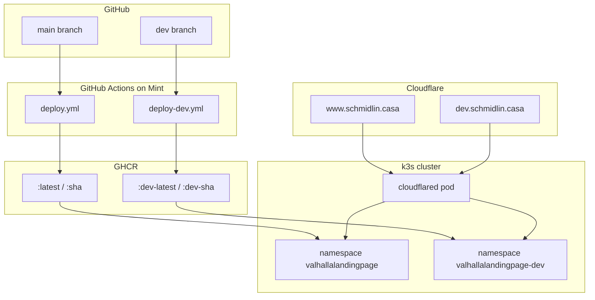

# Dev Deployment — `dev.schmidlin.casa`

This guide sets up a **second, isolated deployment** of the Valhalla Landing Page at **`https://dev.schmidlin.casa`**. It runs in its own Kubernetes namespace, uses its own container image tags, and **automatically redeploys whenever you push to the `dev` branch**.

Production (`https://www.schmidlin.casa`, `main` branch) is unchanged. Dev and prod share the same homelab cluster, the same `cloudflared` tunnel, and the same GHCR package — but they do **not** share pods, namespaces, or `:latest` image tags.

**Prerequisites:**

- Production is already live per [CustomDomainSetup.md](CustomDomainSetup.md) and [ChangeDomain.md](ChangeDomain.md) (or equivalent Cloudflare Tunnel setup for `schmidlin.casa`).
- The self-hosted GitHub Actions runner on Mint is **Idle** / **Active** ([Runners settings](https://github.com/mschmidlin1/ValhallaLandingPage/settings/actions/runners)).
- You can SSH to Mint and run `kubectl`.

---

## Summary

| | Production | Dev |
|---|------------|-----|
| **Public URL** | `https://www.schmidlin.casa` | `https://dev.schmidlin.casa` |
| **Git branch** | `main` | `dev` |
| **Workflow** | [`.github/workflows/deploy.yml`](../.github/workflows/deploy.yml) | `.github/workflows/deploy-dev.yml` (you create this) |
| **K8s namespace** | `valhallalandingpage` | `valhallalandingpage-dev` |
| **Image tags** | `:latest`, `:<commit-sha>` | `:dev-latest`, `:dev-<commit-sha>` |
| **K8s manifests** | [`k8s/`](../k8s/) | `k8s/dev/` (you create this) |
| **Tunnel route** | `www` → prod Service | `dev` → dev Service |

**What stays shared:** one k3s cluster, one `cloudflared` pod, one GHCR image repository (`ghcr.io/mschmidlin1/valhallalandingpage`), one self-hosted runner.

---

## Architecture



Pushing to **`dev`** only rebuilds and rolls out the dev namespace. Pushing to **`main`** only affects production. Dev pushes must **not** overwrite production's `:latest` tag — the dev workflow uses `:dev-latest` and `:dev-<sha>` instead.

---

## Migration overview

| Phase | What |
|-------|------|
| 1 | Create the `dev` branch |
| 2 | Add Kubernetes manifests under `k8s/dev/` |
| 3 | Add GitHub Actions workflow `.github/workflows/deploy-dev.yml` |
| 4 | Push to `dev` — first automated deploy |
| 5 | Add Cloudflare Tunnel route for `dev.schmidlin.casa` |
| 6 | Verify end-to-end |
| 7 | Document URLs in the repo (optional) |

Phases 2–3 can land on `main` first (recommended) or directly on `dev`. The workflow file **must exist on the branch you push** for Actions to run it.

---

## Phase 1 — Create the `dev` branch

If the branch does not exist yet:

```bash
# From your local clone, with main up to date
git checkout main
git pull origin main
git checkout -b dev
git push -u origin dev
```

On GitHub: **Branches** tab should list `dev` alongside `main`.

**Day-to-day workflow after setup:**

1. Check out `dev`, make changes, push → dev site updates.
2. When ready for production, merge `dev` → `main` (PR or local merge) → prod site updates.

You do **not** need branch protection on `dev` unless you want it. Keep protection on `main` if you already use it.

---

## Phase 2 — Kubernetes manifests for dev

Create a **separate** Kustomize directory. Dev manifests mirror production but use the `valhallalandingpage-dev` namespace and `dev-latest` as the initial image tag.

### 2.1 Directory layout

```text
k8s/dev/
  namespace.yaml
  deployment.yaml
  service.yaml
  kustomization.yaml
```

Do **not** put `cloudflared-deployment.yaml` here — the tunnel is cluster-wide infrastructure, already deployed from [`k8s/kustomization.yaml`](../k8s/kustomization.yaml).

### 2.2 `k8s/dev/namespace.yaml`

```yaml
apiVersion: v1
kind: Namespace
metadata:
  name: valhallalandingpage-dev
```

### 2.3 `k8s/dev/deployment.yaml`

Same container spec as production; only namespace, labels, and image tag differ.

```yaml
apiVersion: apps/v1
kind: Deployment
metadata:
  name: valhallalandingpage
  namespace: valhallalandingpage-dev
spec:
  replicas: 1
  selector:
    matchLabels:
      app: valhallalandingpage-dev
  template:
    metadata:
      labels:
        app: valhallalandingpage-dev
    spec:
      containers:
        - name: app
          image: ghcr.io/mschmidlin1/valhallalandingpage:dev-latest
          ports:
            - containerPort: 80
          livenessProbe:
            httpGet:
              path: /
              port: 80
            initialDelaySeconds: 5
            periodSeconds: 10
          readinessProbe:
            httpGet:
              path: /
              port: 80
            initialDelaySeconds: 3
            periodSeconds: 5
          resources:
            requests:
              cpu: 50m
              memory: 64Mi
            limits:
              cpu: 200m
              memory: 128Mi
```

### 2.4 `k8s/dev/service.yaml`

```yaml
apiVersion: v1
kind: Service
metadata:
  name: valhallalandingpage
  namespace: valhallalandingpage-dev
spec:
  type: ClusterIP
  selector:
    app: valhallalandingpage-dev
  ports:
    - port: 80
      targetPort: 80
```

### 2.5 `k8s/dev/kustomization.yaml`

```yaml
apiVersion: kustomize.config.k8s.io/v1beta1
kind: Kustomization

resources:
  - namespace.yaml
  - deployment.yaml
  - service.yaml
```

### 2.6 Apply once manually (optional smoke test)

Before wiring CI, you can apply empty manifests on Mint. The pod will not start until an image exists — that is expected until Phase 4.

```bash
kubectl apply -k k8s/dev/
kubectl get all -n valhallalandingpage-dev
```

---

## Phase 3 — GitHub Actions workflow for `dev`

Create **`.github/workflows/deploy-dev.yml`**. It triggers on pushes to **`dev`** (and supports manual runs).

### 3.1 Full workflow file

```yaml
name: Deploy Dev

on:
  push:
    branches:
      - dev
  workflow_dispatch:

permissions:
  contents: read
  packages: write

jobs:
  deploy:
    runs-on: self-hosted

    env:
      KUBECONFIG: /home/mike/.kube/config

    steps:
      - name: Checkout
        uses: actions/checkout@v4

      - name: Log in to GHCR
        run: echo "${{ secrets.GITHUB_TOKEN }}" | docker login ghcr.io -u "${{ github.actor }}" --password-stdin

      - name: Build and push image
        run: |
          IMAGE=ghcr.io/mschmidlin1/valhallalandingpage
          docker build -t "${IMAGE}:dev-${{ github.sha }}" -t "${IMAGE}:dev-latest" .
          docker push "${IMAGE}:dev-${{ github.sha }}"
          docker push "${IMAGE}:dev-latest"

      - name: Apply Kubernetes manifests
        run: kubectl apply -k k8s/dev/

      - name: Roll out new image
        run: |
          kubectl set image deployment/valhallalandingpage \
            app=ghcr.io/mschmidlin1/valhallalandingpage:dev-${{ github.sha }} \
            -n valhallalandingpage-dev
          kubectl rollout status deployment/valhallalandingpage \
            -n valhallalandingpage-dev \
            --timeout=5m
```

### 3.2 Why separate image tags?

| Tag | Used by |
|-----|---------|
| `:latest`, `:sha` | Production (`deploy.yml` on `main`) |
| `:dev-latest`, `:dev-sha` | Dev (`deploy-dev.yml` on `dev`) |

If dev used `:latest`, every dev push would retag production's image pointer and create confusion about what prod is running. Separate tags keep environments isolated.

### 3.3 Get the workflow onto GitHub

**Option A — Recommended: merge infrastructure via `main`, then sync `dev`**

1. On a feature branch from `main`, add `k8s/dev/` and `.github/workflows/deploy-dev.yml`.
2. Open a PR → merge to **`main`**.
3. Update local `dev` from `main`:

   ```bash
   git checkout dev
   git merge main
   git push origin dev
   ```

4. The push to `dev` triggers the first **Deploy Dev** run.

**Option B — Add files directly on `dev`**

1. Check out `dev`, add the files from Phases 2–3, commit, push.
2. The first push triggers **Deploy Dev** (workflow must be in that commit).

Either way, confirm the workflow appears under **Actions** → **Deploy Dev** on GitHub.

---

## Phase 4 — First automated deploy

After pushing commits that include the workflow and manifests:

1. Open [GitHub Actions](https://github.com/mschmidlin1/ValhallaLandingPage/actions).
2. Select the latest **Deploy Dev** run triggered by your push to `dev`.
3. Expand each step and confirm green checks:
   - **Build and push image** — pushes `:dev-latest` and `:dev-<sha>`
   - **Apply Kubernetes manifests** — creates/updates `valhallalandingpage-dev` namespace
   - **Roll out new image** — pod reaches Ready

On Mint:

```bash
kubectl get pods -n valhallalandingpage-dev
```

Expected: **STATUS** `Running`, **READY** `1/1`.

```bash
kubectl get pods -n valhallalandingpage-dev -o jsonpath='{.items[0].spec.containers[0].image}{"\n"}'
```

Expected: `ghcr.io/mschmidlin1/valhallalandingpage:dev-<commit-sha>`.

**In-cluster HTTP check (no tunnel yet):**

```bash
kubectl run curl-test --rm -it --restart=Never --image=curlimages/curl -- \
  curl -s -o /dev/null -w "HTTP %{http_code}\n" \
  http://valhallalandingpage.valhallalandingpage-dev.svc.cluster.local/
```

Expected: `HTTP 200`.

If the workflow fails, see [Troubleshooting](#troubleshooting) below before continuing.

---

## Phase 5 — Cloudflare Tunnel route for `dev.schmidlin.casa`

The dev app runs in the cluster but is not public until you add a **Public Hostname** on the existing tunnel (same tunnel as production — do **not** create a second tunnel).

### 5.1 Add the public hostname

1. Open [Cloudflare Zero Trust](https://one.dash.cloudflare.com/) → **Networks** → **Tunnels**.
2. Click your existing tunnel (e.g. `homelab-k3s`). Confirm status **Healthy**.
3. **Public Hostname** tab → **Add a public hostname**.
4. Fill in:

| Field | Value |
|-------|-------|
| **Subdomain** | `dev` |
| **Domain** | `schmidlin.casa` |
| **Path** | *(leave empty)* |
| **Type** | `HTTP` |
| **URL** | `http://valhallalandingpage.valhallalandingpage-dev.svc.cluster.local:80` |

5. Save.

Cloudflare creates a proxied DNS record for `dev.schmidlin.casa` automatically.

### 5.2 Confirm DNS

1. [Cloudflare Dashboard](https://dash.cloudflare.com) → **`schmidlin.casa`** → **DNS** → **Records**.
2. You should see **`dev`** (proxied, orange cloud) pointing at the tunnel.

You should already have **`www`** for production. Both hostnames can coexist on one tunnel.

### 5.3 Optional — restrict who can view dev

Dev is publicly reachable by default (same as prod). To limit access:

1. Zero Trust → **Access** → **Applications** → add an application for `dev.schmidlin.casa`.
2. Define a policy (e.g. allow only your email).

That is optional and not required for this guide.

---

## Phase 6 — Verify the public dev URL

From any machine:

```bash
curl -I https://dev.schmidlin.casa
```

Expected: `HTTP/2 200` (or `HTTP/1.1 200`) with a valid certificate for `dev.schmidlin.casa`.

Open **`https://dev.schmidlin.casa`** in a browser — you should see the Valhalla landing page.

### 6.1 Confirm dev and prod are independent

1. Make a visible change on **`dev`** only (e.g. temporary text in `src/index.html`).
2. Push to **`dev`**, wait for **Deploy Dev** to finish.
3. **`https://dev.schmidlin.casa`** shows the change.
4. **`https://www.schmidlin.casa`** should be **unchanged**.
5. Revert the test change on `dev` when done.

### 6.2 Confirm prod deploy still works

Merge or push to **`main`** and confirm **Deploy** (production workflow) still succeeds and prod URL is unaffected.

---

## Phase 7 — Update repo documentation (optional)

Add dev URL references where helpful:

| File | Suggested addition |
|------|-------------------|
| [`README.md`](../README.md) | Row in local vs production table; link to this doc |
| [`docs/ChangeDomain.md`](ChangeDomain.md) | Note that `dev.schmidlin.casa` is a separate route |

Search for places that list only production:

```bash
grep -rn "www.schmidlin.casa" .
```

---

## Day-to-day operations

| Task | How |
|------|-----|
| Deploy to dev | Push (or merge) to **`dev`** |
| Deploy to prod | Merge **`dev` → `main`** (or push directly to `main`) |
| Watch dev deploy | [Actions → Deploy Dev](https://github.com/mschmidlin1/ValhallaLandingPage/actions) |
| Dev pod health | `kubectl get pods -n valhallalandingpage-dev` |
| Dev logs | `kubectl logs -n valhallalandingpage-dev deploy/valhallalandingpage -f` |
| Roll back dev | `kubectl rollout undo deployment/valhallalandingpage -n valhallalandingpage-dev` |
| Redeploy dev without code changes | Actions → **Deploy Dev** → **Run workflow** (select branch `dev`) |
| Pull dev image locally | `docker pull ghcr.io/mschmidlin1/valhallalandingpage:dev-latest` |

**Typical feature flow:**

```bash
git checkout dev
# edit src/...
git add -A && git commit -m "Try new gauge layout"
git push origin dev
# → dev.schmidlin.casa updates in ~1–2 minutes

# When happy:
git checkout main
git merge dev
git push origin main
# → www.schmidlin.casa updates
```

---

## Troubleshooting

### Deploy Dev workflow does not appear after push to `dev`

- The workflow file must exist **in the commit you pushed**. Merge `main` into `dev` if you added the workflow only on `main`.
- Check **Actions** tab → **Deploy Dev** is listed. If missing, the YAML is not on the branch yet.

### Build succeeds but pod stays `ImagePullBackOff`

- GHCR package must allow pulls from your cluster (public package, or image pull secret). Production already pulls from the same registry — if prod works, dev should too.
- Verify the tag exists: [GHCR package](https://github.com/mschmidlin1/ValhallaLandingPage/pkgs/container/valhallalandingpage) → look for `dev-latest` / `dev-<sha>`.

### `Apply Kubernetes manifests` fails with KUBECONFIG error

Same fix as production — the runner service does not load `~/.bashrc`. The workflow sets:

```yaml
env:
  KUBECONFIG: /home/mike/.kube/config
```

See [Self-Hosting.md — KUBECONFIG gotcha](Self-Hosting.md#common-gotcha-kubeconfig-in-ci).

### In-cluster curl returns 200 but `dev.schmidlin.casa` fails

| Symptom | Fix |
|---------|-----|
| DNS NXDOMAIN | Public hostname not saved; check Cloudflare DNS for `dev` record |
| 502 / tunnel error | `kubectl get pods -n cloudflared` — tunnel pod must be Running |
| Wrong site / 404 | Tunnel **URL** must be `http://valhallalandingpage.valhallalandingpage-dev.svc.cluster.local:80` (note `-dev` namespace) |
| SSL error | Domain **Active** in Cloudflare; SSL/TLS mode **Full** on `schmidlin.casa` |

```bash
kubectl logs -n cloudflared -l app=cloudflared --tail=50
```

### Dev push changed production

- Dev workflow must use `:dev-latest` / `:dev-<sha>`, not `:latest`.
- Dev workflow must target namespace `valhallalandingpage-dev`, not `valhallalandingpage`.
- Dev workflow must run `kubectl apply -k k8s/dev/`, not `k8s/`.

### Runner busy / queue stuck

Only one job runs at a time on a single self-hosted runner. If prod and dev deploys queue, wait for the active job to finish or add a second runner (out of scope here).

---

## What does not change

| Component | Notes |
|-----------|-------|
| [`k8s/deployment.yaml`](../k8s/deployment.yaml) (prod) | Untouched |
| [`.github/workflows/deploy.yml`](../.github/workflows/deploy.yml) (prod) | Still triggers on `main` only |
| [`k8s/cloudflared-deployment.yaml`](../k8s/cloudflared-deployment.yaml) | One tunnel serves both hostnames |
| `cloudflared` secret / token | Domain-agnostic |
| [`src/js/links.js`](../src/js/links.js) | Same source tree built into both images |

---

## Completion checklist

- [ ] `dev` branch exists on GitHub
- [ ] `k8s/dev/` manifests committed (namespace, deployment, service, kustomization)
- [ ] `.github/workflows/deploy-dev.yml` committed on `dev` (and ideally `main`)
- [ ] **Deploy Dev** workflow run succeeded on push to `dev`
- [ ] `kubectl get pods -n valhallalandingpage-dev` → Running `1/1`
- [ ] In-cluster curl → HTTP 200
- [ ] Cloudflare public hostname `dev.schmidlin.casa` → dev Service URL
- [ ] `curl -I https://dev.schmidlin.casa` → 200
- [ ] Test change on `dev` does **not** appear on `www.schmidlin.casa`
- [ ] Production **Deploy** workflow still works on push to `main`

---

## See also

- [ChangeDomain.md](ChangeDomain.md) — production URL on `schmidlin.casa`
- [CustomDomainSetup.md](CustomDomainSetup.md) — Cloudflare Tunnel setup
- [Self-Hosting.md](Self-Hosting.md) — pipeline overview and cluster commands
- [KubernetesSetup.md](KubernetesSetup.md) — one-time cluster and runner setup
