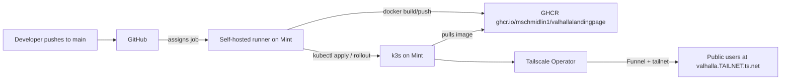

# Kubernetes Auto-Deploy Setup

Auto-deploy from `git push main` → GHCR → k3s on a Linux Mint host, exposed via the Tailscale Kubernetes Operator, using a self-hosted GitHub Actions runner on the Mint box.

**This guide uses Valhalla Landing Page as the concrete example** — a static nginx site with no secrets or database.

> **Shared infrastructure:** Section 1 is **one-time per machine**. If you already set up k3s, Tailscale Operator, and Docker for another project (e.g. Resume Customizer), skip to the per-repo steps: register a runner for **this** repo (Section 1.6) and create **this** app's namespace (Section 1.7).

## Architecture



Key choices: **k3s** (single binary, lightweight), **self-hosted runner** (builds locally, no inbound GitHub webhook exposure), **GHCR** (free, native to GitHub Actions), **Tailscale Operator Ingress** with Funnel (HTTPS on `*.ts.net` without router port forwarding).

### Naming reference (this repo)

| Item | Value |
|------|-------|
| GitHub repo | `github.com/mschmidlin1/ValhallaLandingPage` |
| GHCR image | `ghcr.io/mschmidlin1/valhallalandingpage` |
| K8s namespace + resource names | `valhallalandingpage` |
| Ingress TLS host (public URL prefix) | `valhalla` |
| Public URL | `https://valhalla.<your-tailnet>.ts.net` |
| Container port | `80` (nginx) |

The namespace name and public URL prefix are **intentionally different** — same pattern as other apps on the cluster.

---

# Section 1 — What you do on the Linux Mint box

Do these in order. All commands assume Mint 21/22 with sudo.

### 1.1 Base packages

```bash
sudo apt update && sudo apt upgrade -y
sudo apt install -y curl ca-certificates git apt-transport-https jq
```

### 1.2 Install Docker (the self-hosted runner needs it to build the image)

```bash
curl -fsSL https://get.docker.com | sh
sudo usermod -aG docker $USER
newgrp docker   # or log out/in
docker run --rm hello-world
```

### 1.3 Install k3s

```bash
curl -sfL https://get.k3s.io | sh -
# kubeconfig for your user (k3s keeps the original at /etc/rancher/k3s/k3s.yaml as root-only)
mkdir -p ~/.kube
sudo cp /etc/rancher/k3s/k3s.yaml ~/.kube/config
sudo chown $USER:$USER ~/.kube/config
chmod 600 ~/.kube/config
# k3s's /usr/local/bin/kubectl shim defaults to the root-only file, not ~/.kube/config
export KUBECONFIG=$HOME/.kube/config
echo 'export KUBECONFIG=$HOME/.kube/config' >> ~/.bashrc
source ~/.bashrc
sed -i "s/127.0.0.1/$(hostname -I | awk '{print $1}')/" ~/.kube/config  # optional; only if kubectl from another machine on LAN
kubectl get nodes   # should show one Ready node (e.g. STATUS Ready, ROLES control-plane)
```

If `kubectl` still reports `permission denied` on `/etc/rancher/k3s/k3s.yaml`, confirm `echo $KUBECONFIG` prints `/home/<you>/.kube/config` and that `~/.kube/config` exists. As a one-off: `kubectl --kubeconfig=$HOME/.kube/config get nodes`.

### 1.4 Install Tailscale on the host

```bash
curl -fsSL https://tailscale.com/install.sh | sh
sudo tailscale up
tailscale status
```

Note your tailnet name (e.g. `tail1234.ts.net`) — you'll need it when verifying the public URL. Find it under **DNS** in the [Tailscale admin console](https://login.tailscale.com/admin/dns).

### 1.5 Install Helm and the Tailscale Kubernetes Operator

You'll first need to define ACL tags and create an OAuth client in the Tailscale admin console — see Section 3.2 (tags first, then OAuth). Come back here after that.

```bash
curl https://raw.githubusercontent.com/helm/helm/main/scripts/get-helm-3 | bash
helm repo add tailscale https://pkgs.tailscale.com/helmcharts
helm repo update
helm upgrade --install tailscale-operator tailscale/tailscale-operator \
  --namespace=tailscale --create-namespace \
  --set-string oauth.clientId="<paste from web step>" \
  --set-string oauth.clientSecret="<paste from web step>" \
  --set-string apiServerProxyConfig.mode="true"
kubectl get pods -n tailscale   # operator pod should be Running
kubectl get ingressclass        # should list "tailscale"
```

When you connect from another machine via `tailscale configure kubeconfig`, the proxy authenticates you as your Tailscale login (not the k3s admin cert). Grant that user Kubernetes RBAC on Mint before using kubectl from Windows — see [headlamp-setup.md §1.3](headlamp-setup.md).

### 1.6 Install the GitHub self-hosted runner

Complete **Section 3.1 step 3** first so the runner registration page is open. On **Settings → Actions → Runners → New self-hosted runner → Linux x64**, GitHub shows a **Configure** section with shell commands. Paste those lines from GitHub — do not run the example-shaped lines below.

**Run on the Mint box** (in order):

```bash
mkdir -p ~/actions-runner && cd ~/actions-runner
```

```bash
# Copy from GitHub Configure — the command that starts with `curl -o actions-runner-linux-x64` (example only; paste yours from GitHub):
# curl -o actions-runner-linux-x64-2.331.0.tar.gz -L https://github.com/actions/runner/releases/download/v2.331.0/actions-runner-linux-x64-2.331.0.tar.gz

# Copy from GitHub Configure — the command that starts with `tar xzf ./actions-runner-linux-x64` (example only; paste yours from GitHub):
# tar xzf ./actions-runner-linux-x64-2.331.0.tar.gz

# Copy from GitHub Configure — the command that starts with `./config.sh --url` (one-time token; paste yours from GitHub):
# ./config.sh --url https://github.com/mschmidlin1/ValhallaLandingPage --token EXAMPLE_TOKEN_DO_NOT_USE
```

After you run `./config.sh`, it prompts for runner group, runner name, labels, and work folder. **Press Enter at each prompt** to accept the defaults (Default runner group, hostname as runner name, built-in labels including `self-hosted`, and `_work` as the work folder). That is enough for this guide — the deploy workflow only needs `runs-on: self-hosted`.

When `config.sh` finishes, install and start the service (from the runner install directory):

```bash
cd ~/actions-runner
sudo ./svc.sh install
sudo ./svc.sh start
sudo ./svc.sh status
```

Ensure the runner's user (your login user) is in the `docker` group and has `~/.kube/config` (Section 1.3).

> **Per-repo runners:** Runners are registered **per GitHub repository**. If you already have a runner for another repo on this machine, you still need a **second** runner registered to `ValhallaLandingPage` (separate `~/actions-runner` directory or a second service).

### 1.7 Create namespace and pre-stage cluster

```bash
kubectl create namespace valhallalandingpage
```

That's the entire host-side setup for this app. Everything else flows from CI.

---

# Section 2 — What lives in this repo

Final layout:

```
.github/workflows/deploy.yml   # build + push + kubectl apply on every push to main
Dockerfile                     # nginx:alpine serving src/ (see DockerSetup.md)
.dockerignore
k8s/namespace.yaml             # idempotent namespace declaration
k8s/deployment.yaml            # 1 replica, nginx on port 80
k8s/service.yaml               # ClusterIP port 80 -> pod 80
k8s/ingress.yaml               # Tailscale Operator Ingress with funnel
k8s/kustomization.yaml         # ties the above together
```

No Kubernetes Secrets — this static site has no API keys or database credentials.

### 2.1 `.github/workflows/deploy.yml`

Job header — **required** because the runner service does not source `~/.bashrc`:

```yaml
jobs:
  deploy:
    runs-on: self-hosted
    env:
      KUBECONFIG: /home/mike/.kube/config
```

Replace `/home/mike` with your runner user's home directory if different.

- Triggers on `push: branches: [main]` and `workflow_dispatch`.
- `runs-on: self-hosted` (your Mint runner).
- Job-level `env.KUBECONFIG` so every `kubectl` step uses the user-owned kubeconfig from Section 1.3. Without this, CI falls back to `/etc/rancher/k3s/k3s.yaml` (root-only) and fails with `permission denied`.
- Permissions: `contents: read`, `packages: write`.
- Steps:
  1. Checkout.
  2. `docker login ghcr.io` using `${{ secrets.GITHUB_TOKEN }}`.
  3. `docker build -t ghcr.io/mschmidlin1/valhallalandingpage:${{ github.sha }} -t ghcr.io/mschmidlin1/valhallalandingpage:latest .`
  4. `docker push` both tags.
  5. `kubectl apply -k k8s/` to apply manifests.
  6. `kubectl set image deployment/valhallalandingpage app=ghcr.io/mschmidlin1/valhallalandingpage:${{ github.sha }} -n valhallalandingpage`.
  7. `kubectl rollout status deployment/valhallalandingpage -n valhallalandingpage --timeout=5m` (fails the build if rollout fails).

### 2.2 `k8s/deployment.yaml` highlights

- `replicas: 1` (stateless static site).
- Single container `app` from `ghcr.io/mschmidlin1/valhallalandingpage:latest` (CI bumps to SHA via `kubectl set image`).
- `imagePullSecrets` only if the GHCR package is private (planning for **public package** by default).
- Liveness/readiness probes: `httpGet path: / port: 80`.
- Modest resources: 50m CPU / 64Mi request, 200m CPU / 128Mi limit.
- No volume mounts, no `env:` from secrets.

### 2.3 `k8s/service.yaml`

ClusterIP, `port: 80 -> targetPort: 80`, selector `app: valhallalandingpage`.

### 2.4 `k8s/ingress.yaml` (Tailscale Operator)

```yaml
apiVersion: networking.k8s.io/v1
kind: Ingress
metadata:
  name: valhallalandingpage
  namespace: valhallalandingpage
  annotations:
    tailscale.com/funnel: "true"
spec:
  ingressClassName: tailscale
  defaultBackend:
    service:
      name: valhallalandingpage
      port:
        number: 80
  tls:
    - hosts: ["valhalla"]
```

Result: app reachable at `https://valhalla.<your-tailnet>.ts.net` with auto-issued TLS, **no port forwarding, no public IP exposed**.

**Custom domain caveat**: Tailscale auto-TLS only covers `*.ts.net`. To use a custom domain with a fully trusted browser cert, you need cert-manager + DNS-01 — a follow-up after the base pipeline is green. The initial setup uses the `*.ts.net` URL.

### 2.5 `k8s/kustomization.yaml`

Lists the four manifests so `kubectl apply -k k8s/` is one call.

### 2.6 Branching

Work happens on a feature branch (e.g. `kubernetes-setup`), then a PR merges to `main`. The workflow only fires on pushes to `main`, so the merge itself is the first deploy.

---

# Section 3 — What you do on GitHub's website (and tailscale.com)

### 3.1 On github.com/mschmidlin1/ValhallaLandingPage

1. **Settings → Actions → General**: ensure Actions are enabled. Under **Workflow permissions**, set **Read and write permissions** (lets the workflow push to GHCR). Under **Approval for running fork pull request workflows from contributors**, select **Require approval for all external contributors**, then click **Save**.
2. **Settings → Branches → Add branch protection rule** (or edit the existing rule for `main`):
   - Branch name pattern: `main`
   - Enable **Require a pull request before merging** (optional but recommended; deploy runs after merge).
   - Click **Create** or **Save changes**.
3. **Settings → Actions → Runners → New self-hosted runner → Linux x64**: copy the Configure commands onto the Mint box (Section 1.6). Do not type URLs or tokens by hand — paste from GitHub.
4. **No GitHub Actions secrets required** for this static site.
5. **(After first successful push)** open the container package and confirm visibility is **public** (recommended) so k3s can pull without `imagePullSecrets`:
   - **From the repo:** [ValhallaLandingPage](https://github.com/mschmidlin1/ValhallaLandingPage) → right sidebar **Packages** → **valhallalandingpage**, or the **Packages** tab in the repo header.
   - **Direct link:** [pkgs/container/valhallalandingpage](https://github.com/mschmidlin1/ValhallaLandingPage/pkgs/container/valhallalandingpage)
   - **From your profile:** [github.com/mschmidlin1?tab=packages](https://github.com/mschmidlin1?tab=packages) → **valhallalandingpage** → **Package settings** → set visibility to public if needed.

### 3.2 On login.tailscale.com (admin console)

Do these in order. **Define ACL tags before creating the OAuth client** — the operator and proxy devices rely on those tags.

#### 3.2.1 Access controls — define tags

Open [Access controls](https://login.tailscale.com/admin/acls) (left sidebar → **Access controls**).

**Visual editor (recommended):**

1. Select the **Visual editor** tab, then the **Tags** tab.
2. **Add tag** → name `k8s-operator` (no `tag:` prefix) → owners `autogroup:admin` (or **Admins**) → **Save tag**.
3. **Add tag** again → name `k8s` → owners `tag:k8s-operator` → **Save tag**.
4. Confirm both tags appear in the Tags table, then save the policy if prompted.

**JSON editor (alternative):** merge a `tagOwners` block into your existing policy:

   ```jsonc
   "tagOwners": {
     "tag:k8s-operator": ["autogroup:admin"],
     "tag:k8s":          ["tag:k8s-operator"]
   }
   ```

| Tag | Purpose |
|-----|---------|
| `tag:k8s-operator` | The operator pod registers itself with this tag |
| `tag:k8s` | Ingress/proxy pods get this tag |

#### 3.2.2 Trust credentials — create OAuth client

Open [Trust credentials](https://login.tailscale.com/admin/settings/trust-credentials) (**Settings** → **Trust credentials**).

1. Click **Credential** → **OAuth**.
2. Scope preset: **All-read and write** (not All-read).
3. Click **Generate credential**. Copy **Client ID** and **Client secret** immediately — the secret is shown only once. They go into the Helm install in Section 1.5.

#### 3.2.3 DNS and Funnel

**DNS page** — open [DNS](https://login.tailscale.com/admin/dns) and enable:

1. **MagicDNS** (required for `*.ts.net` hostnames).
2. **HTTPS certificates** (required for TLS on ingress).

**Access controls — allow Funnel for k8s proxies** — return to [Access controls](https://login.tailscale.com/admin/acls).

**Visual editor:**

1. **Visual editor** tab → **Node attributes** (last tab in the list).
2. **Add node attribute**: Targets `tag:k8s`, Attributes `funnel`.
3. Save the policy.

**JSON editor (alternative):**

   ```jsonc
   "nodeAttrs": [
     {
       "target": ["tag:k8s"],
       "attr":   ["funnel"]
     }
   ]
   ```

Tagged proxy devices are not tailnet members, so member-only Funnel permission is not enough for the Kubernetes operator.

---

## End-to-end verification (after all three sections)

1. Push a change to `main` (or merge a PR).
2. Watch the run at `github.com/mschmidlin1/ValhallaLandingPage/actions` — it should run on your self-hosted runner.
3. On the Mint box: `kubectl get pods -n valhallalandingpage -w` — see the pod reach Running 1/1.
4. `kubectl get ingress -n valhallalandingpage` — should show the Tailscale-provisioned hostname.
5. Open `https://valhalla.<your-tailnet>.ts.net` in any browser — site should load with a valid cert.
6. Roll back drill: `kubectl rollout undo deployment/valhallalandingpage -n valhallalandingpage`.

### In-cluster smoke test (optional)

After the pod is Running:

```bash
kubectl run curl-test --rm -it --restart=Never --image=curlimages/curl -- \
  curl -s -o /dev/null -w "%{http_code}\n" http://valhallalandingpage.valhallalandingpage.svc.cluster.local/
```

Expected: `200`.

## Day-2 operations

- **Tail logs**: `kubectl logs -n valhallalandingpage deploy/valhallalandingpage -f`
- **Restart pod**: `kubectl rollout restart deployment/valhallalandingpage -n valhallalandingpage`
- **Roll back to previous revision**: `kubectl rollout undo deployment/valhallalandingpage -n valhallalandingpage`
- **Force a redeploy without a code change**: re-run the workflow from the Actions tab (`workflow_dispatch`).

## Risks / things to know

- **Build time**: static nginx images build in seconds; Docker layer cache on the runner makes repeat deploys fast.
- **GHCR package visibility**: public by default. Private packages require a `regcred` Secret + `imagePullSecrets` on the Deployment.
- **KUBECONFIG in CI**: the workflow must set `KUBECONFIG` explicitly — the runner systemd service does not load `~/.bashrc`.
- **Custom-domain TLS**: fully-trusted browser certs on a non-`*.ts.net` domain need cert-manager; use the `*.ts.net` URL first.

---

## See also

- [Self-Hosting.md](Self-Hosting.md) — plain-language overview of how the pipeline fits together.
- [DockerSetup.md](DockerSetup.md) — Dockerfile and local smoke-test playbook.
