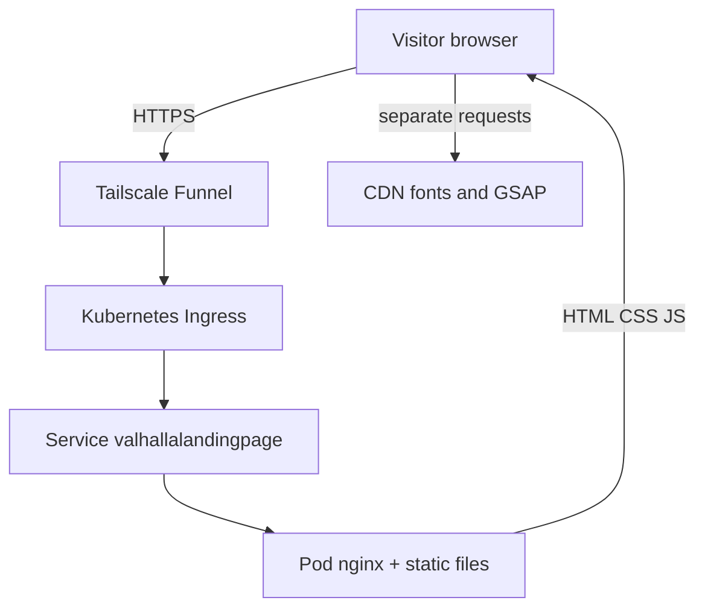
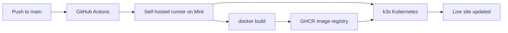

# Self-Hosting — How This Site Works

This document explains how **Valhalla Landing Page** is built, deployed, and served to visitors — without assuming you already know Docker, Kubernetes, or Tailscale.

It also tells you **where to look** (GitHub pages, shell commands) so you can see each piece in the real system and learn how they connect.

For step-by-step setup commands, see [KubernetesSetup.md](KubernetesSetup.md) and [DockerSetup.md](DockerSetup.md).

---

## The short version

Valhalla is a **static website** (HTML, CSS, JavaScript — no server-side code). When you merge a change to the `main` branch on GitHub, an automated pipeline on a **Linux PC at home** builds a small **container image**, stores it on GitHub, and tells **Kubernetes** to run it. **Tailscale** exposes that running site to the public internet at a URL like `https://valhalla.<your-tailnet>.ts.net` — with HTTPS and **without** opening ports on your router or paying for traditional web hosting.

**First thing to try after a deploy:** open the [Actions tab](https://github.com/mschmidlin1/ValhallaLandingPage/actions) and confirm the latest **Deploy** run is green, then open `https://valhalla.<your-tailnet>.ts.net` in a browser.

---

## The parts (in plain language)

| Term | What it is | Analogy | Where to see it |
|------|------------|---------|-----------------|
| **GitHub** | Where the source code lives | The master copy of your project | [github.com/mschmidlin1/ValhallaLandingPage](https://github.com/mschmidlin1/ValhallaLandingPage) |
| **GitHub Actions** | Automation that runs when you push to `main` | A robot that follows a checklist after every update | [Actions tab](https://github.com/mschmidlin1/ValhallaLandingPage/actions) — click any **Deploy** run to see each step's log |
| **Self-hosted runner** | A small program on your home Linux PC that runs those Actions jobs | The robot's hands — it runs on your machine, not in GitHub's cloud | Repo → **Settings → Actions → Runners**: [Runners page](https://github.com/mschmidlin1/ValhallaLandingPage/settings/actions/runners) — should show **Idle** or **Active** |
| **Docker / container image** | A packaged snapshot: nginx web server + your static files | A sealed box that runs the site the same way every time | [GHCR package](https://github.com/mschmidlin1/ValhallaLandingPage/pkgs/container/valhallalandingpage) — each deploy adds a new tag (commit SHA + `latest`) |
| **GHCR** | GitHub Container Registry — where built images are stored | A locker GitHub and your server both have keys to | Repo → **Packages** tab or [profile Packages tab](https://github.com/mschmidlin1?tab=packages) |
| **k3s / Kubernetes** | Software that keeps containers running and restarts them if they crash | A foreman that makes sure exactly one copy of your site is always up | On Mint: `kubectl get nodes` |
| **Pod** | One running instance of your container | The foreman's worker actually serving files | On Mint: `kubectl get pods -n valhallalandingpage` |
| **Service** | A stable internal address for the pod inside the cluster | The desk extension number other cluster parts dial | On Mint: `kubectl get svc -n valhallalandingpage` |
| **Ingress** | Routes external traffic to the Service | The building's reception desk | On Mint: `kubectl get ingress -n valhallalandingpage` — note the hostname in **ADDRESS** |
| **Tailscale Operator** | Kubernetes integration that connects Ingress to your Tailscale network | Reception plugged into Tailscale instead of the public phone grid | On Mint: `kubectl get pods -n tailscale` |
| **Tailscale Funnel** | Lets anyone on the internet reach a specific Tailscale hostname | A controlled public doorway — HTTPS, no router config | [Tailscale DNS admin](https://login.tailscale.com/admin/dns) — find your tailnet name; public URL is `https://valhalla.<tailnet>.ts.net` |

---

## Explore it yourself

Use this section after a deploy (or anytime the site should be live). Run the Mint commands over SSH on your home Linux PC. Each block answers: *"I read about X — where is it actually?"*

### GitHub — source code and pipeline

| What you want to see | Where to go |
|----------------------|-------------|
| The website source files | [Repo root](https://github.com/mschmidlin1/ValhallaLandingPage) → `src/` folder |
| The deploy recipe (when/how CI runs) | [`.github/workflows/deploy.yml`](https://github.com/mschmidlin1/ValhallaLandingPage/blob/main/.github/workflows/deploy.yml) on GitHub |
| Every deploy that has run | [Actions](https://github.com/mschmidlin1/ValhallaLandingPage/actions) — click a run → expand **Build and push image**, **Apply Kubernetes manifests**, etc. |
| Whether your home PC is connected as a runner | [Settings → Actions → Runners](https://github.com/mschmidlin1/ValhallaLandingPage/settings/actions/runners) |
| Re-run a deploy without changing code | Actions → **Deploy** workflow → **Run workflow** (dropdown on the right) |

**Connect the dots:** In an Actions run log, find the commit SHA in the image tag (e.g. `ghcr.io/mschmidlin1/valhallalandingpage:abc1234...`). Then open the [GHCR package](https://github.com/mschmidlin1/ValhallaLandingPage/pkgs/container/valhallalandingpage) — you should see that same SHA as a tag on the image.

### GitHub — container image (GHCR)

The **container image** is not stored inside the repo like normal files. After CI builds it, GitHub Container Registry (GHCR) hosts it at `ghcr.io/mschmidlin1/valhallalandingpage`. The web UI for that image is:

**Direct link:** [github.com/mschmidlin1/ValhallaLandingPage/pkgs/container/valhallalandingpage](https://github.com/mschmidlin1/ValhallaLandingPage/pkgs/container/valhallalandingpage)

#### How to get there from the main project page

1. Open the repo: [github.com/mschmidlin1/ValhallaLandingPage](https://github.com/mschmidlin1/ValhallaLandingPage)
2. Look at the **right-hand sidebar** (below **About**, above **Releases**). If at least one deploy has pushed an image, you should see a **Packages** section listing **valhallalandingpage** — click that name.
3. If the sidebar is collapsed (narrow window), widen the browser or scroll the repo home page — **Packages** stays on the right on desktop layouts.

**Alternative paths** if the sidebar link is missing or you are browsing from elsewhere:

| Starting point | Steps |
|----------------|-------|
| **Repo top navigation** | On the repo page, click **Packages** in the horizontal tab bar (between **Actions** and **Projects** if visible). Then click **valhallalandingpage**. |
| **Your GitHub profile** | [github.com/mschmidlin1?tab=packages](https://github.com/mschmidlin1?tab=packages) → find **valhallalandingpage** in the list (shows all packages you own). |
| **After an Actions run** | [Actions tab](https://github.com/mschmidlin1/ValhallaLandingPage/actions) → open a green **Deploy** run → expand **Build and push image** → the log mentions `ghcr.io/mschmidlin1/valhallalandingpage:<sha>`; use the direct link above to view that tag in the UI. |

#### What to look for on the package page

1. **Recent tagged image versions** — each successful deploy adds a row tagged with the git commit SHA (and often `latest`)
2. Click a version to see **when it was published** and its **digest** (`sha256:...`)
3. **Install from the command line** shows the exact `docker pull` command for that tag

Your Kubernetes cluster pulls from this registry when it starts or updates the pod. Match the tag on this page to the image reported by:

```bash
kubectl get pods -n valhallalandingpage -o jsonpath='{.items[0].spec.containers[0].image}{"\n"}'
```

**On Mint (optional):** after a local or CI build, see images Docker knows about:

```bash
docker images | grep valhallalandingpage
```

You should see `ghcr.io/mschmidlin1/valhallalandingpage` with `latest` and SHA tags.

### Kubernetes — what's running on Mint

All commands below assume you are SSH'd into the Mint box and `kubectl` works (see [KUBECONFIG gotcha](#common-gotcha-kubeconfig-in-ci) if not).

**Big picture — everything in this app's namespace:**

```bash
kubectl get all -n valhallalandingpage
```

You should see a **pod**, **service**, and **deployment** named `valhallalandingpage`.

**Just the live pod(s):**

```bash
kubectl get pods -n valhallalandingpage
```

Look for **STATUS** `Running` and **READY** `1/1`. The pod name includes a random suffix (e.g. `valhallalandingpage-7d4b9c8f6-xk2lm`).

**Which container image is the pod actually running?**

```bash
kubectl get pods -n valhallalandingpage -o jsonpath='{.items[0].spec.containers[0].image}{"\n"}'
```

Compare that SHA to the tag on [GHCR](https://github.com/mschmidlin1/ValhallaLandingPage/pkgs/container/valhallalandingpage) and to the commit in the green [Actions run](https://github.com/mschmidlin1/ValhallaLandingPage/actions).

**More detail when something looks wrong:**

```bash
kubectl describe pod -n valhallalandingpage -l app=valhallalandingpage
```

Scroll to **Events** at the bottom — pull errors, crash loops, and probe failures show up here.

**Deployment, Service, and Ingress together:**

```bash
kubectl get deployment,svc,ingress -n valhallalandingpage
```

**Public URL hostname (from the cluster's point of view):**

```bash
kubectl get ingress -n valhallalandingpage
```

The **ADDRESS** or host column is what Tailscale assigned (e.g. `valhalla.your-tailnet.ts.net`).

**Deploy history (see previous revisions after multiple deploys):**

```bash
kubectl rollout history deployment/valhallalandingpage -n valhallalandingpage
```

**What the nginx container is printing:**

```bash
kubectl logs -n valhallalandingpage deploy/valhallalandingpage -f
```

Press Ctrl+C to stop following. Access logs appear here when people visit the site.

**Prove the app works inside the cluster (before blaming Tailscale):**

```bash
kubectl run curl-test --rm -it --restart=Never --image=curlimages/curl -- \
  curl -s -o /dev/null -w "HTTP %{http_code}\n" \
  http://valhallalandingpage.valhallalandingpage.svc.cluster.local/
```

Expected: `HTTP 200`. If this works but the public URL does not, the issue is in Ingress/Tailscale, not the pod.

**All namespaces on the cluster (context for where Valhalla sits):**

```bash
kubectl get namespaces
```

You should see `valhallalandingpage` alongside system namespaces (`kube-system`, `tailscale`, etc.).

### Tailscale — public access

| What you want to see | Where to go |
|----------------------|-------------|
| Your tailnet DNS name | [login.tailscale.com/admin/dns](https://login.tailscale.com/admin/dns) |
| Machines on your tailnet (including k8s proxy nodes) | [login.tailscale.com/admin/machines](https://login.tailscale.com/admin/machines) |
| The live site | Browser → `https://valhalla.<your-tailnet>.ts.net` |

Cross-check: the hostname in `kubectl get ingress -n valhallalandingpage` should match what you type in the browser.

---

## When someone opens the website

A visitor types `https://valhalla.<your-tailnet>.ts.net` in a browser. Here is what happens:

1. **DNS** resolves the hostname (Tailscale MagicDNS + your tailnet name).
2. **Tailscale Funnel** accepts the HTTPS connection from the public internet and forwards it into your tailnet.
3. The **Tailscale proxy** (created by the Kubernetes Ingress) receives the request.
4. The **Ingress** sends traffic to the **Service** named `valhallalandingpage`.
5. The **Service** forwards to the **Pod** running **nginx**.
6. **nginx** returns `index.html`, CSS, and JavaScript from the container filesystem.
7. The **browser** loads additional assets from CDNs (Google Fonts, GSAP on cdnjs) — those requests go straight from the visitor's browser to the CDN, not through your server.



**While someone (or you) loads the page**, run on Mint:

```bash
kubectl logs -n valhallalandingpage deploy/valhallalandingpage --tail=20
```

You should see nginx access log lines with `GET /`, `GET /css/...`, `GET /js/...`. CDN requests will **not** appear — those never hit your server.

---

## When you push a change to `main`

Every merge (or direct push) to `main` triggers the **Deploy** workflow in [`.github/workflows/deploy.yml`](../.github/workflows/deploy.yml):

1. **GitHub** queues a job and assigns it to your **self-hosted runner** on the Mint PC.
2. The runner **checks out** the latest code from the repo.
3. **Docker build** packages `src/` into an nginx image tagged with the commit SHA and `:latest`.
4. **Docker push** uploads both tags to **GHCR** (`ghcr.io/mschmidlin1/valhallalandingpage`).
5. **kubectl apply** syncs the Kubernetes manifests in `k8s/` (Deployment, Service, Ingress, namespace).
6. **kubectl set image** tells the Deployment to use the new SHA-tagged image.
7. Kubernetes performs a **rolling update**: starts a new pod with the new image, waits until it is healthy, then retires the old one.
8. If anything fails (bad image, pod won't start), the workflow **fails** and the previous version keeps running.



You do not SSH into the server to deploy manually — the pipeline does it.

### Follow a deploy live

Open two windows: the [Actions run](https://github.com/mschmidlin1/ValhallaLandingPage/actions) in your browser and an SSH session on Mint.

| Step in Actions log | What to run on Mint while it runs |
|---------------------|-----------------------------------|
| Build and push image | `docker images \| grep valhallalandingpage` — new SHA tag appears after push |
| Apply Kubernetes manifests | `kubectl get all -n valhallalandingpage` — resources created or unchanged |
| Roll out new image | `kubectl get pods -n valhallalandingpage -w` — watch old pod terminate, new pod reach `Running` |

When the workflow shows green, confirm:

1. [Actions](https://github.com/mschmidlin1/ValhallaLandingPage/actions) — all steps passed
2. [GHCR package](https://github.com/mschmidlin1/ValhallaLandingPage/pkgs/container/valhallalandingpage) — new version with today's timestamp
3. `kubectl get pods -n valhallalandingpage` — `Running` `1/1`
4. Browser — `https://valhalla.<tailnet>.ts.net` shows your change

**Redeploy without code changes:** Actions → **Deploy** → **Run workflow**.

---

## Naming cheat sheet

Different layers use different names — that is normal:

| Layer | Name | Example | Where you see it |
|-------|------|---------|------------------|
| GitHub repo | `ValhallaLandingPage` | github.com/mschmidlin1/ValhallaLandingPage | Browser URL bar on GitHub |
| Docker / GHCR image | lowercase, no hyphens | `ghcr.io/mschmidlin1/valhallalandingpage` | [Packages page](https://github.com/mschmidlin1/ValhallaLandingPage/pkgs/container/valhallalandingpage), `kubectl get pod ... -o jsonpath=...` |
| Kubernetes namespace | lowercase, no hyphens | `valhallalandingpage` | `kubectl get namespaces` |
| Deployment / Service / Ingress | same as namespace | `valhallalandingpage` | `kubectl get all -n valhallalandingpage` |
| Public URL prefix | short, memorable | `valhalla` | `kubectl get ingress -n valhallalandingpage`, browser address bar |

Only the **public URL prefix** (`valhalla`) is what visitors see. The namespace is an internal label inside Kubernetes.

---

## What lives where

### In this repository

| Path | Role | View on GitHub |
|------|------|----------------|
| `src/` | The actual website (HTML, CSS, JS) | [/tree/main/src](https://github.com/mschmidlin1/ValhallaLandingPage/tree/main/src) |
| `Dockerfile` | Recipe to build the nginx container | [/blob/main/Dockerfile](https://github.com/mschmidlin1/ValhallaLandingPage/blob/main/Dockerfile) |
| `.dockerignore` | Files excluded from the container image | [/blob/main/.dockerignore](https://github.com/mschmidlin1/ValhallaLandingPage/blob/main/.dockerignore) |
| `k8s/` | Kubernetes manifests | [/tree/main/k8s](https://github.com/mschmidlin1/ValhallaLandingPage/tree/main/k8s) |
| `.github/workflows/deploy.yml` | CI/CD pipeline definition | [/blob/main/.github/workflows/deploy.yml](https://github.com/mschmidlin1/ValhallaLandingPage/blob/main/.github/workflows/deploy.yml) |
| `docs/` | Documentation | [/tree/main/docs](https://github.com/mschmidlin1/ValhallaLandingPage/tree/main/docs) |

### On the home Linux PC (Mint)

| Component | Role | How to inspect |
|-----------|------|----------------|
| k3s | Kubernetes cluster (shared across apps) | `kubectl get nodes` |
| Docker | Builds images when Actions runs | `docker images`, `docker ps` (during a build, a container may appear briefly) |
| Self-hosted runner | Executes GitHub Actions jobs locally | GitHub [Runners page](https://github.com/mschmidlin1/ValhallaLandingPage/settings/actions/runners); on Mint: `sudo ~/actions-runner/svc.sh status` |
| `~/.kube/config` | Lets kubectl talk to k3s | `echo $KUBECONFIG` (should be `~/.kube/config` in interactive shells) |

Section 1 of [KubernetesSetup.md](KubernetesSetup.md) is **one-time per machine**. Adding a new app later mostly means a new runner registration, a new namespace, and a new repo with its own `k8s/` folder.

### On GitHub

| Component | Role | Link |
|-----------|------|------|
| Repository | Source code + workflow files | [ValhallaLandingPage](https://github.com/mschmidlin1/ValhallaLandingPage) |
| Actions | Runs the Deploy workflow | [Actions tab](https://github.com/mschmidlin1/ValhallaLandingPage/actions) |
| Packages (GHCR) | Stores built container images | [valhallalandingpage package](https://github.com/mschmidlin1/ValhallaLandingPage/pkgs/container/valhallalandingpage) |

### On Tailscale admin (tailscale.com)

| Setting | Role | Link |
|---------|------|------|
| OAuth client | Lets the Kubernetes operator join your tailnet | [Trust credentials](https://login.tailscale.com/admin/settings/trust-credentials) |
| MagicDNS + HTTPS certificates | Enables `*.ts.net` hostnames with TLS | [DNS](https://login.tailscale.com/admin/dns) |
| Funnel ACL for `tag:k8s` | Allows public internet access to ingress proxies | [Access controls](https://login.tailscale.com/admin/acls) |

---

## Local development vs production

| | Local dev | Production |
|---|-----------|------------|
| **How you run it** | VS Code Live Server on `src/index.html` | nginx inside a Kubernetes pod |
| **URL** | `http://localhost:5500` | `https://valhalla.<tailnet>.ts.net` |
| **Updates** | Save file → browser refresh | Merge to `main` → automatic deploy |
| **Where to verify** | Browser only | [Actions](https://github.com/mschmidlin1/ValhallaLandingPage/actions) + `kubectl get pods -n valhallalandingpage` + browser |

There is no build step in either environment — the same static files in `src/` are what you edit locally and what nginx serves in production.

---

## Day-to-day operations

**Deploy a change:** merge (or push) to `main`. Watch the green check on the [Actions tab](https://github.com/mschmidlin1/ValhallaLandingPage/actions).

**Quick health check:**

```bash
kubectl get pods -n valhallalandingpage
```

Expected: `Running`, `1/1`.

**View logs:**

```bash
kubectl logs -n valhallalandingpage deploy/valhallalandingpage -f
```

**Roll back a bad deploy:**

```bash
kubectl rollout undo deployment/valhallalandingpage -n valhallalandingpage
```

Then confirm with `kubectl get pods -n valhallalandingpage -w` and refresh the public URL.

**Redeploy without code changes:** [Actions → Deploy → Run workflow](https://github.com/mschmidlin1/ValhallaLandingPage/actions/workflows/deploy.yml).

More commands: [KubernetesSetup.md — Day-2 operations](KubernetesSetup.md#day-2-operations).

---

## Common gotcha: KUBECONFIG in CI

Interactive SSH sessions on Mint work with `kubectl` because your shell loads `KUBECONFIG=$HOME/.kube/config` from `~/.bashrc`. The GitHub Actions runner runs as a **systemd service** and does **not** load `.bashrc`, so CI must set `KUBECONFIG` explicitly in the workflow:

```yaml
env:
  KUBECONFIG: /home/mike/.kube/config
```

Without this, `kubectl apply` fails with `permission denied` on `/etc/rancher/k3s/k3s.yaml`. Details: [KubernetesSetup.md Section 2.1](KubernetesSetup.md#21-githubworkflowdeployyml).

**Symptom on GitHub:** the **Apply Kubernetes manifests** step fails while **Build and push image** succeeded. Fix the workflow, push again, and re-watch the [Actions run](https://github.com/mschmidlin1/ValhallaLandingPage/actions).

---

## Further reading

- [KubernetesSetup.md](KubernetesSetup.md) — full setup guide (Mint host, repo files, GitHub, Tailscale admin)
- [DockerSetup.md](DockerSetup.md) — Dockerfile playbook and local `docker run` smoke test
- [README.md](../README.md) — editing the site content and running Live Server locally
