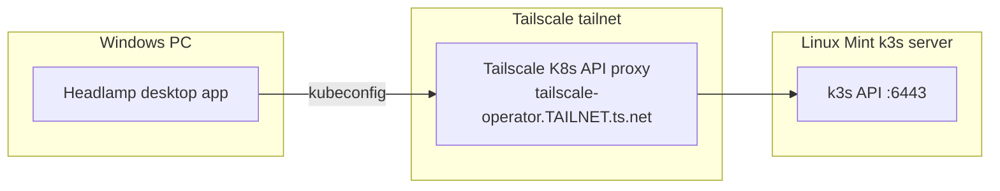

# Headlamp Setup — Kubernetes UI for Your Homelab

This guide installs **Headlamp**, a free open-source Kubernetes UI, for the same homelab stack described in [KubernetesSetup.md](KubernetesSetup.md):

- **k3s** on a Linux Mint server
- **Tailscale** (including the Kubernetes Operator with API server proxy enabled)
- **Windows PC** as your daily management machine

Headlamp talks to the Kubernetes API — the same API `kubectl` uses. It does not replace k3s or change how your apps deploy.

## What you get

| kubectl task | Headlamp equivalent |
|--------------|---------------------|
| `kubectl get pods -A` | Workloads → Pods (all namespaces) |
| `kubectl logs -f …` | Pod detail → Logs (streamed) |
| `kubectl describe pod …` | Pod detail → Events / metadata panels |
| `kubectl exec -it … -- sh` | Pod detail → Terminal |
| `kubectl apply -f …` | Create / edit resources in the UI |
| `kubectl rollout restart …` | Deployment → Restart |
| `kubectl get ingress -A` | Network → Ingresses |

Keep `kubectl` for scripts, CI, and quick one-liners. Your GitHub Actions runner on Mint continues to use `kubectl` regardless of Headlamp.

## Architecture

Headlamp runs as a **desktop app on your Windows PC**. It uses the same kubeconfig as `kubectl` and reaches the cluster through the Tailscale Kubernetes API proxy — no extra pods or Helm installs on Mint.



---

# Setup

No changes to your cluster are required.

## Prerequisites

Complete these on Mint before starting ([KubernetesSetup.md](KubernetesSetup.md)):

1. k3s is running ([KubernetesSetup.md §1.3](KubernetesSetup.md)).
2. Tailscale Operator is installed with API server proxy enabled ([KubernetesSetup.md §1.5](KubernetesSetup.md)) — you already have `apiServerProxyConfig.mode="true"`.
3. `kubectl get nodes` succeeds on Mint.

## 1.1 Install Tailscale on Windows

Download and run the MSI installer from [Tailscale for Windows](https://tailscale.com/download/windows).

### Log in to your tailnet

In PowerShell:

```powershell
Start-Service Tailscale
tailscale up
```

`tailscale up` opens your browser to the Tailscale login page. Sign in with the **same account** you used on the Mint server when you ran `sudo tailscale up` ([KubernetesSetup.md §1.4](KubernetesSetup.md)). If the browser asks you to connect or authorize this Windows machine, approve it.

If no browser opens, copy the URL printed in PowerShell and open it manually.

Confirm you are connected:

```powershell
tailscale status
```

Expected: a list of machines on your tailnet (including Mint). If you see `Tailscale is not running`, run `Start-Service Tailscale` and `tailscale up` again.

## 1.2 Install Headlamp on Windows

Open PowerShell and run:

```powershell
winget install headlamp
```

Alternatives:

- Chocolatey: `choco install headlamp`
- Manual installer: [Headlamp releases on GitHub](https://github.com/kubernetes-sigs/headlamp/releases)

### Unsigned-app warning

Headlamp desktop builds may not be code-signed yet. If Windows SmartScreen blocks the app, choose **More info → Run anyway**. This is expected for current CNCF/SIG UI builds.

To upgrade later:

```powershell
winget upgrade headlamp
```

## 1.3 Configure kubeconfig on Windows via Tailscale

Tailscale must be connected on Windows (§1.1) before running the commands below.

Because your Tailscale Operator exposes the Kubernetes API privately on the tailnet, use Tailscale's kubeconfig helper on Windows.

### Find the operator hostname

On the Mint server:

```bash
kubectl get svc -n tailscale
tailscale status
```

Look for a Tailscale hostname associated with the operator — commonly `tailscale-operator` (default). The full MagicDNS name will look like:

```text
tailscale-operator.<your-tailnet>.ts.net
```

Your tailnet name is under **DNS** in the [Tailscale admin console](https://login.tailscale.com/admin/dns) (same place you found it for the Valhalla ingress URL).

### Grant Tailscale user access on Mint (one-time)

The API server proxy runs in **auth mode** by default ([KubernetesSetup.md §1.5](KubernetesSetup.md)): requests from your Windows PC are authenticated as your **Tailscale login** (typically your email), not the k3s admin certificate. Kubernetes RBAC must grant that identity permission to use the API.

On the **Mint server**, bind your Tailscale user to `cluster-admin` (homelab — adjust for production):

```bash
kubectl create clusterrolebinding ts-cluster-admin \
  --clusterrole=cluster-admin \
  --user=<your-tailscale-email>
```

Replace `<your-tailscale-email>` with the address you use to sign in to Tailscale on Windows (same account as Mint). Example: `mschmidlin1@gmail.com`.

Verify the binding:

```bash
kubectl describe clusterrolebinding ts-cluster-admin
```

Expected: your email appears under **Subjects**.

For read-only cluster access instead of admin, bind to the built-in `view` ClusterRole:

```bash
kubectl create clusterrolebinding ts-view \
  --clusterrole=view \
  --user=<your-tailscale-email>
```

### Generate kubeconfig on Windows

On your **Windows PC**:

```powershell
tailscale configure kubeconfig tailscale-operator
```

If your operator uses a custom hostname, substitute it:

```powershell
tailscale configure kubeconfig <your-operator-hostname>
```

This merges a context into `%USERPROFILE%\.kube\config` that points at the Tailscale API proxy. Authentication is handled by Tailscale — you must be on the tailnet to connect.

Verify from PowerShell:

```powershell
kubectl get nodes
```

Expected: one node in `Ready` state, same as on Mint.

### How this differs from the Mint kubeconfig

| | Mint `~/.kube/config` | Windows via `tailscale configure kubeconfig` |
|--|----------------------|-----------------------------------------------|
| Server URL | `https://127.0.0.1:6443` or LAN IP | `https://tailscale-operator.<tailnet>.ts.net` |
| Auth | k3s client certificate | Tailscale identity (token shown as `unused`) |
| Requires port 6443 exposed | Only on LAN if using LAN IP | No — API reached through Tailscale proxy |

## 1.4 Launch Headlamp and connect

1. Open **Headlamp** from the Start menu.
2. On first launch, Headlamp reads `%USERPROFILE%\.kube\config` automatically.
3. Your cluster context should appear in the cluster list. Select it.
4. If prompted for authentication, Headlamp should connect without a token — Tailscale handles auth via your kubeconfig.

You should land on the cluster overview with namespaces, nodes, and workloads visible.

### Using a non-default kubeconfig path

```powershell
$env:KUBECONFIG = "D:\kube\homelab-config"
# Then launch Headlamp from the same terminal, or pass the path as a CLI argument
```

## 1.5 Verify Headlamp works

In Headlamp, confirm you can:

1. See the node under **Cluster → Nodes** (status `Ready`).
2. Open **Workloads → Deployments** and find `valhallalandingpage` in namespace `valhallalandingpage`.
3. Drill into the deployment → pod → **Logs** (nginx access/error logs).
4. Open **Network → Ingresses** and see the Tailscale hostname for Valhalla.

If all four work, Headlamp has replaced your routine read-only `kubectl get` / `logs` workflow.

---

# Day-to-day usage

## Common tasks in Headlamp

| Goal | Navigation |
|------|------------|
| Check if Valhalla is healthy | Workloads → Deployments → `valhallalandingpage` → Pods |
| Stream logs | Pod → Logs tab → enable follow |
| Restart after a bad deploy | Deployment → ⋮ menu → Restart |
| Edit replica count | Deployment → Scale |
| Inspect Tailscale ingress | Network → Ingresses → `valhallalandingpage` |
| Shell into a pod | Pod → Terminal |
| Apply YAML from a file | + Create → Upload / paste YAML |

## When to keep using kubectl

- GitHub Actions deploy pipeline (unchanged).
- Scripted operations (`kubectl apply -k k8s/`, rollouts, smoke tests).
- Copy-paste one-liners from [KubernetesSetup.md](KubernetesSetup.md) troubleshooting sections.

## Updating Headlamp

```powershell
winget upgrade headlamp
```

---

# Troubleshooting

## Headlamp desktop shows no clusters

1. Confirm `%USERPROFILE%\.kube\config` exists on Windows.
2. Run `kubectl get nodes` in the same PowerShell session — if that fails, fix kubeconfig before opening Headlamp.
3. Restart Headlamp after changing kubeconfig.

## `tailscale configure kubeconfig` says "Tailscale is not running"

The Tailscale **client daemon** on Windows is not active. Fix before retrying kubeconfig:

1. Run `Start-Service Tailscale`, then `tailscale up` and complete login in the browser.
2. Run `tailscale status` — it must list tailnet machines, not `Tailscale is not running`.
3. If still failing: open `services.msc`, find **Tailscale**, and start the service (or reboot after a fresh install).

## `kubectl get nodes` fails on Windows (Tailscale method)

1. Confirm Tailscale is connected on Windows (`tailscale status`) — see troubleshooting above if the client is not running.
2. Confirm the operator pod is running on Mint: `kubectl get pods -n tailscale`.
3. Re-run `tailscale configure kubeconfig <operator-hostname>`.
4. Check Tailscale ACLs allow your Windows user to reach the operator device.

### `Forbidden: User "<email>" cannot list resource "nodes"`

The API proxy is working, but your Tailscale identity has no RBAC binding yet. On Mint, create the binding from §1.3 (use the exact email shown in the error):

```bash
kubectl create clusterrolebinding ts-cluster-admin \
  --clusterrole=cluster-admin \
  --user=<email-from-error>
```

### TLS handshake timeout on first request

The in-process API server proxy may be slow to provision TLS on the first connection. Retry `kubectl get nodes` once or twice. If timeouts persist after RBAC is fixed, check steps 1–4 above.

## Headlamp loads but RBAC denies actions

Headlamp respects Kubernetes RBAC. If you bound your Tailscale user to the `view` ClusterRole (§1.3), delete/restart actions will be disabled — that is intentional. Use the `cluster-admin` binding for write operations, or manage RBAC with a dedicated Role/ClusterRole for your needs.

---

# Security notes

1. **Desktop app inherits kubeconfig permissions** — RBAC bindings you create in §1.3 determine what Headlamp can do. Protect your Windows login and `%USERPROFILE%\.kube\config`.
2. **Tailscale API proxy** — only tailnet members with appropriate ACL grants can reach the Kubernetes API; this is safer than exposing port 6443 on your LAN or WAN.

---

## See also

- [KubernetesSetup.md](KubernetesSetup.md) — k3s, Tailscale Operator, and deploy pipeline setup.
- [Self-Hosting.md](Self-Hosting.md) — plain-language overview of the homelab stack.
- [Headlamp documentation](https://headlamp.dev/docs/latest/) — upstream install and feature reference.
